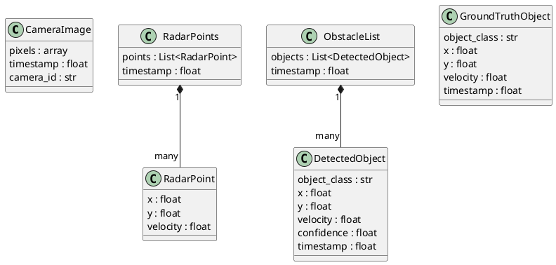
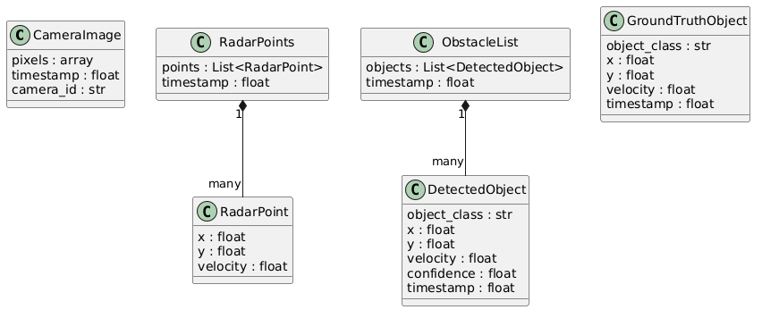

# Detailed Design
---

## 1. Purpose

This document describes the **detailed design** of the perception system: the data
structures exchanged between blocks (the interfaces) and the data flow that connects
them.

It intentionally covers **only the interfaces** — *what* each block receives and
produces — not the internal implementation of each block (the algorithms). Internal
behavior is documented per block at implementation time. This follows the
encapsulation principle: each block is treated as a black box defined by its
inputs and outputs.

This design is derived from:
- the requirements in [01_Requirements.md](01_Requirements.md)
- the architecture in [02_Architecture.md](02_Architecture.md)

---

## 2. Data structures (interfaces)

The data exchanged in the system falls into two categories:

- **Raw data** — unprocessed sensor output (input of perception)
- **Interpreted data** — extracted information (output of perception)

### 2.1 Raw data

**CameraImage** — raw camera output, consumed by Camera Perception.

| Field | Type | Meaning |
|---|---|---|
| pixels | numeric array (H×W×3) | the raw image (RGB pixel values) |
| timestamp | number | acquisition time of the frame |
| camera_id | text | which camera the image comes from (e.g. front) |

**RadarPoints** — raw radar output for one frame, consumed by Radar Processing.

| Field | Type | Meaning |
|---|---|---|
| points | list of RadarPoint | all radar echoes of the frame |
| timestamp | number | acquisition time of the frame |

**RadarPoint** — a single radar echo.

| Field | Type | Meaning |
|---|---|---|
| x | number | longitudinal position (distance ahead) |
| y | number | lateral position (left/right) |
| velocity | number | relative velocity (Doppler) |

### 2.2 Interpreted data

**DetectedObject** — an obstacle produced by perception.

| Field | Type | Meaning | Requirement |
|---|---|---|---|
| object_class | text | class of the object (car, pedestrian, …) | REQ-06 |
| x | number | longitudinal position (distance ahead) | REQ-02 |
| y | number | lateral position (left/right) | REQ-02 |
| velocity | number | relative velocity | ADAS use |
| confidence | number (0–1) | how sure the system is of this detection | REQ-09 |
| timestamp | number | which frame this object belongs to | REQ-12 |

**ObstacleList** — the system output for one frame.

| Field | Type | Meaning |
|---|---|---|
| objects | list of DetectedObject | all obstacles detected in the frame |
| timestamp | number | frame the list belongs to |

**GroundTruthObject** — a reference object (human annotation).
Same as DetectedObject but **without** a confidence score: annotations are asserted
as true, not predicted.

| Field | Type | Meaning |
|---|---|---|
| object_class | text | annotated class |
| x | number | longitudinal position |
| y | number | lateral position |
| velocity | number | annotated velocity |
| timestamp | number | frame the object belongs to |

---

## 3. Data flow between blocks

Each arrow is an interface: the data structure passed from one block to the next.

| From | To | Data passed |
|---|---|---|
| Data Loader | Camera Perception | CameraImage |
| Data Loader | Radar Processing | RadarPoints |
| Camera Perception | Fusion | list of DetectedObject (from camera) |
| Radar Processing | Fusion | list of DetectedObject (from radar) |
| Fusion | Output | fused ObstacleList |
| Output | Validation | ObstacleList |
| Ground Truth | Validation | list of GroundTruthObject |
| Validation | Metrics Report | metrics (recall, precision, latency) |

Key point: the **Data Loader** delivers `CameraImage` and `RadarPoints` with the
**same timestamp**, so that Fusion combines data describing the same scene at the
same moment (REQ-12).

---

## 4. Class diagram

---

## 5. Design decisions

- **Two separate structures for raw vs interpreted data.** A `CameraImage` (pixels)
  and a `DetectedObject` (extracted information) are fundamentally different: raw
  input vs. analyzed output. The perception block is the transformation between them.
- **Confidence only on DetectedObject, not on GroundTruth.** Predictions carry
  uncertainty; annotations are treated as truth.
- **Image dimensions are not stored separately** — they are already contained in the
  pixel array (no redundant data).
- **Camera calibration is out of scope for now** — position is obtained via radar
  and nuScenes annotations, to keep the first version simple.
- **Every data structure carries a timestamp** — required for synchronization and
  for matching detections to the correct ground-truth frame.
