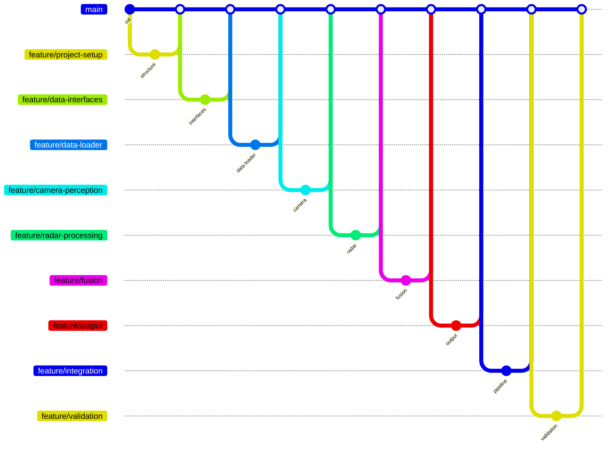

# Git Workflow

---

## 1. Principles

- **`main` is always stable.** No code is committed directly to `main`.
- **One feature branch per unit of work**, named `feature/<name>`.
- Each feature is developed, tested, and only then merged into `main` through a
  **Pull Request (PR)**.
- Every change is covered by automated tests before it is merged.

---

## 2. The cycle for each feature

```
git checkout main                 # start from the stable branch
git pull origin main              # make sure it is up to date
git checkout -b feature/<name>    # create and switch to a feature branch

# ... write code + tests ...
pytest                            # all tests must pass

git add .
git commit -m "Clear, imperative message"
git push origin feature/<name>    # push the branch to GitHub
```

Then on GitHub:
- open a **Pull Request** (base: `main`, compare: `feature/<name>`)
- review the change
- **merge** the PR into `main`

Finally, locally:

```
git checkout main
git pull origin main              # get the merged result
```

---

## 3. Conventions

**Branch names** describe the work:
`feature/data-interfaces`, `feature/data-loader`, `feature/fusion`, …

**Commit messages** are short, in English, and imperative:
`Add Fusion with data association and tests`, `Add Output block with confidence filtering`.

**Every merged feature is tested** — unit tests for each block, plus integration
tests for the full pipeline.

---

## 4. Branch history

Each block of the system was built on its own feature branch and merged into
`main` via a Pull Request:



> GitHub renders this Mermaid diagram automatically in the Markdown preview.

---

## 5. Why this matters

This workflow keeps `main` releasable at all times, makes each change reviewable
and reversible, and ties every feature to its tests. It is the same process used
in professional software teams, applied here to a personal engineering project.
